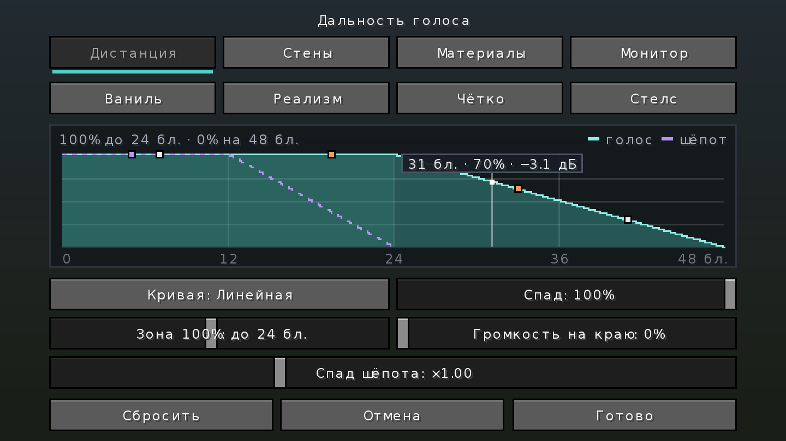
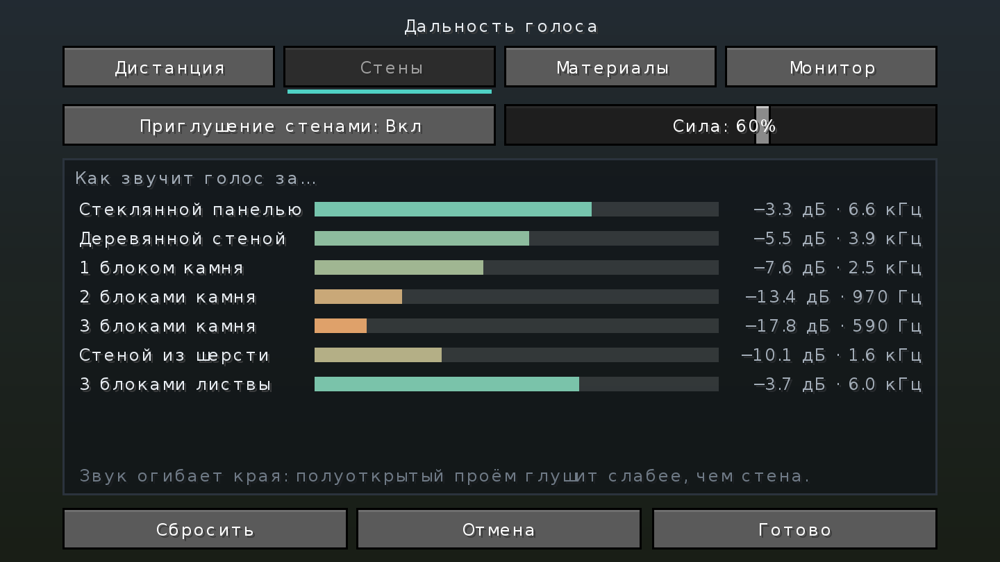
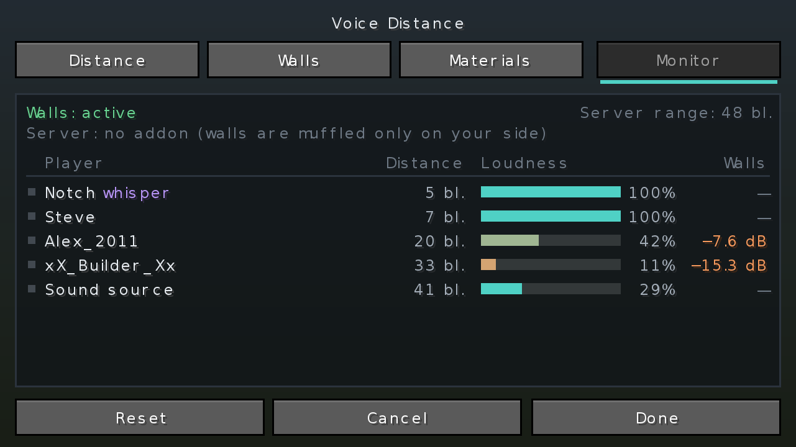
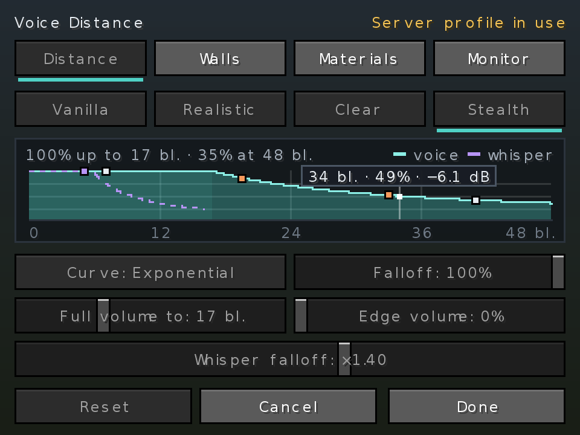

# 🎙️ Voice Physics — Simple Voice Chat addon

[](https://www.minecraft.net/)
[](https://fabricmc.net/)
[](#versions-and-files)
[](https://modrinth.com/plugin/simple-voice-chat)
[](https://github.com/Shamanalle/voice-physics/actions/workflows/build.yml)
[](https://github.com/Shamanalle/voice-physics/releases)
[](LICENSE)

**[English](#english)** · **[Русский](#русский)**

| Distance / Дистанция | Walls / Стены | Monitor / Монитор | Server profile / Профиль сервера |
|---|---|---|---|
|  |  |  |  |

<sub>Renders of the settings screen made outside the game with the mod's own layout and drawing code. · Рендеры экрана настроек вне игры тем же кодом раскладки и отрисовки, что в моде.</sub>

---

## English

An addon for **[Simple Voice Chat](https://modrinth.com/plugin/simple-voice-chat)** that shapes how voices fade with distance and muffles them through walls.

It works on either side, and each side is useful alone:
- **Client only** — you choose how *you* hear voices: curve, walls, echo, HUD. Nothing is needed on the server.
- **Server only** — players with plain Simple Voice Chat hear voices muffled through walls, and the server gets sound zones and game rules.
- **Both** — everything, plus the server's sound profile, zones with echo and entry messages, and the Server tab for admins.

See [What works where](#what-works-where) for the full list.

### Features

#### Distance curve (client)
- **Three curves:** linear (Simple Voice Chat's own), realistic 1/r and a true exponential. Each one fades to silence at the edge of the range, so voices never cut off abruptly.
- **Adjustable:** falloff, the distance heard at full volume, the volume at the edge of the range, and whisper falloff.
- **Live graph:**
  - shows the loudness at every distance;
  - hover it for the exact value in blocks, % and dB;
  - the whisper curve is dashed;
  - the people you hear right now appear as dots.
- **Edge volume** is where the curve ends: the whole fade is fitted between 100% and it, so the voice reaches it exactly at the edge of the range. It is also set as OpenAL `AL_MIN_GAIN`, scaled by each player's own volume, so muted players stay muted.

#### Walls (client)
- Voices behind walls become **quieter and duller**: a 24 dB/octave low-pass filter plus broadband loss.
  - One stone wall at the default strength: about −8 dB, muffled above ~2.5 kHz.
  - Three stone walls: about −18 dB and ~600 Hz.
- **Real block shapes:** slabs, open doors, fences and carpets do not count as full cubes.
- **Soft edges:** 5 parallel rays instead of one, so a voice around a corner or through a doorway fades gradually instead of switching.
- **Materials:** 13 groups — stone, metal, earth & sand, wood, wool, soft blocks, glass, ice, doors, leaves, bars & fences, water & lava, and *other blocks* for everything else (bedrock, blocks from other mods). Wool and metal muffle more than stone, glass and leaves less. Every group's weight is adjustable on the *Materials* tab.
- **Smooth:** filter changes glide over ~90 ms without clicks. Without a wall the audio passes through bit for bit.
- **Sound Physics Remastered:** when it is installed, our wall muffling turns itself off so voices are not muffled twice.

#### Echo, water and weather (client)
- **Echo in caves and halls:** every half second 18 rays from your head measure how closed and how big the space around you is. A big cave or hall gives a long echo, a small room a short one, the open air none. The echo glides as you walk and has its own strength setting.
- **Under water:** when your head or the speaker's is under water, voices become dull (~600 Hz) and 10 dB quieter.
- **Rain and thunder:** under the open sky, rain takes up to 6 dB off far voices and a thunderstorm up to about 10 dB; close voices stay clear.
- **Around corners:** when a wall is between you, the addon looks for a way round it through open blocks (air, water, open doors and gates, fences). If a doorway or window is close, the voice comes through it: less muffled than through the wall, and from the doorway's side, like a voice from the next room through an open door.
- The *Effects* tab has a switch for each, the echo strength, and a live view of what is around you right now.
- With Sound Physics Remastered installed, our echo and water stay off (it does them itself); rain still works.

#### Voice HUD (client)
A small panel in a corner of the screen:
- who is talking nearby, how far away and from which direction (an arrow), whispering or behind a wall;
- **while you talk: how many players hear you** — within your voice range, or your whisper range while you whisper — and how many cannot (no voice chat, sound off);
- modes: off, while talking (default: only when someone speaks), always (also how many are in range); any of the four corners; a key in Controls cycles the modes;
- size (50–150%), background opacity (down to none) and a **compact** mode with one line for everyone talking — on the Monitor tab.

#### Monitor (client)
Shows live:
- every player within voice range, talking or not, how far away and in which direction;
- how loud each voice reaches you and how much the walls take off;
- who has no Simple Voice Chat, has it disconnected, turned the sound off, or is in a voice chat group — from your own Simple Voice Chat (2.6.1+: disconnected, sound off) and, when the server has the addon, from the server (all of them);
- whether the server has the addon.

Talking players come first, then the others by distance. A **radar** view shows the same from above, with the voice and whisper range as rings; marks differ in shape as well as color (square talking, cross whispering, diamond behind a wall). The monitor also shows how long the addon's own work takes per tick; above 2 ms it spaces that work out by itself. Only players you can see are listed: spectators (unless you are one), invisible players and, on Paper, players hidden by vanish plugins are left out.

#### Colors for color blindness (client)
*Colors: colorblind* on the Monitor tab switches the HUD, the monitor and the radar to colors that stay apart with red-green color blindness (Okabe–Ito): blue for talking, purple for whispers, orange for walls.

#### Profile codes (client and server)
*Copy profile code* on the Distance tab puts your curve, walls, materials and effects on the clipboard as one line (`VP1:…`); *Paste profile code* takes them from one. Friends can share their sound this way, and a server admin can load a player's code with `/vcd preset import <code>` (or give theirs out with `/vcd preset export`).

#### Listen to the curve (client)
*Listen* on the Distance tab plays a voice walking away from you along the current curve, with a marker moving over the graph, so you hear the fade before you use it.

#### Languages
English, Russian, Ukrainian, German, Spanish, Brazilian Portuguese and Chinese (Simplified).

#### Presets (client)
- **Vanilla** — exactly like Simple Voice Chat: full volume over half the range, then a straight fade.
- **Realistic** — natural 1/r falloff with walls; full volume up to about 12 blocks.
- **Clear** — everyone stays understandable, for events; full volume up to about 24 blocks.
- **Stealth** — hide-and-seek, horror; only people within about 7 blocks are loud.

Realistic, Clear and Stealth set the full-volume zone in blocks, kept within sensible limits of the server's voice range (Realistic: 5–40% of it, Clear: 30–80%, Stealth: 5–30%). A voice at a given distance therefore sounds the same on servers with different ranges. When you join a server with another range, the preset you picked is fitted to it, unless you changed the values yourself. The preset that matches your current settings is highlighted.

#### Server side (optional)
Available as part of the Fabric mod or as a plugin for **Paper, Purpur, Spigot and Bukkit**. Both work the same way and work with the same client.
- **Walls for everyone:** players without the addon hear voices muffled through walls. The server decodes the speaker's audio once, filters it for each listener behind a wall, and re-encodes it. Voices with a clear line of sight, group chat, spectators and other addons' audio are passed through untouched.
- **CPU limit:** at most `server_walls_max_streams` voices (default 24) are processed at once; everything above that passes through. Any error falls back to the original audio, so voice chat never goes silent because of the addon.
- **Server sound profile** for players who have the addon:
  - `suggest` — they get a chat notice and an *Apply server profile* button;
  - `enforce` — the server's profile is used while they play there (fair play for PvP and events); their own settings return when they leave. The server can lock only some parts (`profile_locked`: curve, walls, materials, effects) and leave the rest to the player.
  - **No seeing through walls:** `allow_monitor=false` turns off the monitor, the radar and nearby players in the HUD for everyone, for PvP.
- **Exact whisper range:** the server sends its real voice and whisper distances, so the whisper curve on the graph is exact.
- **Voice chat state of nearby players:** once a second the server tells each player with the addon who within voice range has no Simple Voice Chat, has it disconnected, turned the sound off, or is in a group, for the monitor.
- **Hot reload:** edits to the server settings file are picked up without a restart and sent to connected players.
- **Sound zones:** a world (dimension), a **box** drawn in game with `/vcd zone`, or, on Paper with WorldGuard, a region. A zone can change:
  - how far voices carry (a stage ×2, a library ×0.4, or a range in blocks) — for every player, with or without the addon;
  - whether voices cross its border at all (*isolated*: a soundproof booth);
  - wall strength, a fixed echo (a cathedral) or none, the profile mode and preset, and a message on entering.

  Where zones overlap the highest priority wins. The HUD shows the zone (or its message) when you enter.
- **Game rules:** sneaking players carry less far, dead players are silent until they respawn, spectators are heard only by spectators, and an item held in hand (a goat horn, for example) works as a **megaphone**.
- **Simple Voice Chat groups:** a group hears its members anywhere, so walls and range never apply inside it, and by default no game rule does either. The server can choose which ones do: dead players silent, spectators apart, isolated zones. In **open** groups (heard by nearby players too) zone range, sneaking and the megaphone work for that nearby voice.
- **Addon requirement:** players who have Simple Voice Chat but not the addon (or an older version) can get a message once, on every join, or be disconnected. Players without Simple Voice Chat are never affected.
- **Server tab:** operators with the addon get a *Server* tab in the settings screen with all of this as buttons: profile, preset, walls, rules, the requirement, and zones (make one around you, then set its range, walls, echo and isolation).
- **Messages in every language:** `/vcd` replies and messages to players come in each player's own game language (1.21+). The texts are in `vc-audio-distance-lang/` next to the settings file, where you can change any line or add a language.
- **`/vcd` command** for operators (level 2+) and the console:

  | Command | What it does |
  |---|---|
  | `/vcd` or `/vcd status` | Version, voice range, walls, players with the addon, profile, zones |
  | `/vcd reload` | Re-read the settings file |
  | `/vcd profile off\|suggest\|enforce` | How the profile is offered |
  | `/vcd preset vanilla\|realistic\|clear\|stealth\|custom` | The server's sound |
  | `/vcd preset export` / `/vcd preset import <code>` | The server's profile as a profile code |
  | `/vcd walls 0-100\|off` | Wall strength for everyone, in % |
  | `/vcd serverwalls on\|off` | Walls for players without the addon |
  | `/vcd lock all\|none\|curve,walls,materials,effects` | What players cannot change while the profile is enforced |
  | `/vcd monitor on\|off` | Monitor, radar and nearby players in the HUD for players with the addon |
  | `/vcd zones` | Every zone |
  | `/vcd zone pos1` / `pos2`, `/vcd zone create <name> [radius]` | Make a box zone from two corners, or around you |
  | `/vcd zone set <name> <setting> <value\|default>` | `mode`, `preset`, `voice_range`, `whisper_range`, `range_multiplier`, `walls`, `echo`, `isolated`, `message`, `priority` |
  | `/vcd zone delete <name>`, `/vcd zone info` | Remove a zone; which zone you are in |
  | `/vcd rule sneak 0.1-1\|dead on\|off\|spectators on\|off\|megaphone <item>\|megaphone_range 1-10` | Game rules |
  | `/vcd group dead\|spectators\|zones\|open_range on\|off` | Rules inside Simple Voice Chat groups |
  | `/vcd require off\|suggest\|warn\|kick [version]` | The addon requirement |
  | `/vcd debug <player>` | Whom a player hears and who hears them, and why not |

  Changes are saved to the settings file and sent to players with the addon right away. On Paper the permission is `vcd.admin` (operators by default).

### What works where

The addon can be installed on the client (the player's game), on the server, or on both. Each way works on its own.

**🎮 Addon on your client, server without it** (any server with Simple Voice Chat)
- ✅ Distance curve and presets: how *you* hear voices fading.
- ✅ Walls, doors and glass muffle voices, and voices come through doorways.
- ✅ Echo in caves and halls, dull voices under water, rain and thunder.
- ✅ Voice HUD, monitor and radar with every nearby player.
- ✅ Profile codes, colors for color blindness, all settings.
- ⚠️ Only you hear the difference: other players hear as usual.
- ⚠️ The whisper curve on the graph is approximate (half the range), and the monitor knows less about other players' voice chat.
- ❌ No sound zones, game rules, server profile or Server tab: these need the addon on the server.

**🖥️ Addon on the server, players without it** (plain Simple Voice Chat on their side)
- ✅ Voices are muffled through walls for every player: the server does it for them.
- ✅ Sound zones that change the voice range (stage, library), wall strength, or isolate an area.
- ✅ Game rules: sneaking, dead players, spectators, megaphone.
- ✅ `/vcd` commands for admins, messages in each player's language.
- ✅ Can suggest or require the addon, with a download link.
- ❌ No curve choice, echo, water, weather, HUD or monitor: these need the addon on the client.

**🤝 Addon on both** (everything)
- ✅ Everything above.
- ✅ The server can share its sound profile (suggest it with a button, or enforce it for fair PvP and events), lock all of it or only some parts, and turn off the monitor and radar.
- ✅ Zones also set a fixed echo (a cathedral) and show a message on entering.
- ✅ Exact whisper range on the graph.
- ✅ The monitor shows every nearby player's voice chat state, from the server.
- ✅ Admins get the **Server** tab: zones, rules and settings with buttons.
- The client does the wall muffling itself, and the server skips these players, so voices are never muffled twice.

| | Client only | Server only | Both |
|---|---|---|---|
| Distance curve, presets | ✅ | — | ✅ + server profile |
| Walls | ✅ for you | ✅ for players without the addon | ✅ |
| Echo, water, weather | ✅ | — | ✅ |
| HUD, monitor, radar | ✅ | — | ✅ + state of every player |
| Sound zones: voice range, walls, isolation | — | ✅ | ✅ |
| Sound zones: echo, message on entering | — | — | ✅ |
| Game rules (sneak, dead, spectators, megaphone) | — | ✅ | ✅ |
| Addon requirement, `/vcd` | — | ✅ | ✅ |
| Server tab in game | — | — | ✅ (admins) |
| Server locks settings, turns off the monitor | — | — | ✅ |
| Whisper curve on the graph | approximate | — | exact |

### Versions and files

| Loader | Minecraft | File | Java | Simple Voice Chat |
|---|---|---|---|---|
| **Fabric / Quilt** | 1.20 – 1.20.1 | `voice-physics-fabric-2.0.3+mc1.20.1.jar` | 17+ | 1.20.1-2.4.0+ |
| **Fabric / Quilt** | 1.20.2 – 1.20.4 | `voice-physics-fabric-2.0.3+mc1.20.2-1.20.4.jar` | 17+ | 1.20.2-2.4.0+ |
| **Fabric / Quilt** | 1.20.5 – 1.20.6 | `voice-physics-fabric-2.0.3+mc1.20.5-1.20.6.jar` | 21+ | 1.20.5-2.5.0+ |
| **Fabric / Quilt** | 1.21 – 1.21.11 | `voice-physics-fabric-2.0.3+mc1.21.x.jar` | 21+ | 1.21-2.5.0+ |
| **Fabric** | 26.1 – 26.3 | `voice-physics-fabric-2.0.3+mc26.x.jar` | 25+ | 2.6.0+ |
| **Paper / Purpur / Spigot / Bukkit** (server) | 1.20.1 – 26.3 | `voice-physics-bukkit-2.0.3.jar` | 17+ | Bukkit version |
| Forge | 1.20.1 | `voice-physics-forge-2.0.3+mc1.20.1.jar` | 17+ | 1.20.1-2.4.0+ |
| NeoForge / Forge | 1.20.2 – 1.20.4 | `voice-physics-{neoforge,forge}-2.0.3+mc1.20.2-1.20.4.jar` | 17+ | 1.20.2-2.4.0+ |
| NeoForge / Forge | 1.20.5 – 1.20.6 | `voice-physics-{neoforge,forge}-2.0.3+mc1.20.5-1.20.6.jar` | 21+ | 1.20.5-2.5.0+ |
| NeoForge / Forge | 1.21 – 1.21.11 | `voice-physics-{neoforge,forge}-2.0.3+mc1.21.x.jar` | 21+ | 1.21-2.5.0+ |
| **NeoForge** | 26.1 – 26.3 | `voice-physics-neoforge-2.0.3+mc26.x.jar` | 25+ | 2.6.0+ |
| Forge | 26.1 – 26.3 | `voice-physics-forge-2.0.3+mc26.x.jar` | 25+ | 2.6.0+ |

- **Fabric** is the full version, on the client and on the server. It needs [Fabric API](https://modrinth.com/mod/fabric-api); [Mod Menu](https://modrinth.com/mod/modmenu) is optional.
- **Paper / Purpur / Spigot / Bukkit** is the server side as a plugin: walls for players without the addon, and the server profile for players with it. Players can join with any client: with the Fabric addon, without it, or without mods at all. The plugin is compiled against the 1.20.1 API and checked in CI against every Paper release from 1.20.1 to 26.3: every class, method, field and override it uses resolves the same way (Paper 1.20.5 cannot be checked: its API snapshot is no longer downloadable).
- **NeoForge for 26.x** is the full version, the same as Fabric: client and server, settings screen, walls, HUD, monitor, `/vcd`. The settings are also under *Mods → Voice Physics → Config*.
- **Forge, and NeoForge before 26.x,** are a lite version: distance curves only, configured in `config/vc-audio-distance.properties`. There is no settings screen, no walls, no monitor and no server side (those jars are built for Fabric's class names; 26.x has one set of names for every loader).
- The 1.20.2 – 1.20.4 jar is built for 1.20.4 and the 1.20.5 – 1.20.6 jar for 1.20.6; the Minecraft methods they use have the same signatures on 1.20.2, 1.20.3 and 1.20.5.
- The 1.21.x jar was checked against the signatures of every Minecraft method it uses on each release from 1.21 to 1.21.11.
- The 26.x jar is built for 26.3 and checked in CI on every 26.x release (26.1 – 26.3): every class, method, field and override the jar uses resolves on each one exactly as on 26.3. Where 26.x changed (screens moved to `Gui` in 26.2, SDL input in 26.3), the jar picks the right API at runtime.

### Installation

**Client**
1. Install [Simple Voice Chat](https://modrinth.com/plugin/simple-voice-chat) and [Fabric API](https://modrinth.com/mod/fabric-api).
2. Put the matching `.jar` into `.minecraft/mods/`.
3. In game, open the voice chat settings (`V`) → **Voice Physics…**. The screen is also available from Mod Menu or with your own key (*Options → Controls*, unbound by default).

Changes are heard immediately. *Done* or `Esc` saves; *Cancel* restores everything.

**Server (Fabric)**
1. Put the same `.jar` into the server's `mods/` folder, next to Simple Voice Chat and Fabric API.
2. Start the server once; it creates `config/vc-audio-distance-server.properties`.
3. Walls for players without the addon are on by default. To share a profile, set `profile_mode` to `suggest` or `enforce` and pick a `profile_preset`. Every key in the file has a comment in English and Russian, and the file is re-read automatically.

**Server (Paper / Purpur / Spigot / Bukkit)**
1. Put `voice-physics-bukkit-2.0.3.jar` into the server's `plugins/` folder, next to the Bukkit version of Simple Voice Chat.
2. Start the server once; it creates `plugins/VoicechatAudioDistance/vc-audio-distance-server.properties`.
3. The settings are the same as on Fabric (see below), and the file is also re-read automatically.

### Client settings — `config/vc-audio-distance.properties`

| Key | Range | Default | What it does |
|---|---|---|---|
| `distance_model` | `linear` / `realistic_inverse` / `exponential` | `linear` | Shape of the curve |
| `attenuation_factor` | 0.0 – 1.0 | 1.0 | Falloff strength |
| `openal_reference_ratio` | 0.05 – 1.0 | 0.5 | Share of the range heard at full volume |
| `min_volume_fraction` | 0.0 – 0.5 | 0.0 | Volume at the edge of the range; the curve is fitted to end there |
| `whisper_multiplier` | 0.5 – 2.0 | 1.0 | Falloff multiplier while whispering |
| `occlusion_enabled` | true / false | true | Wall muffling |
| `occlusion_strength` | 0.0 – 1.0 | 0.6 | Wall muffling strength |
| `material.<id>` | 0.0 – 3.0 | see the *Materials* tab | How much one block muffles; stone = 1.0 |
| `reverb_enabled` | true / false | true | Echo in caves and halls |
| `reverb_strength` | 0.0 – 1.0 | 0.6 | Echo strength |
| `underwater_enabled` | true / false | true | Dull, quiet voices under water |
| `weather_enabled` | true / false | true | Rain and thunder cover far voices |
| `diffraction_enabled` | true / false | true | Voices come round walls through doorways |
| `hud_mode` | `off` / `talking` / `always` | `talking` | Voice HUD |
| `hud_corner` | `top_left` / `top_right` / `bottom_left` / `bottom_right` | `top_right` | Corner of the voice HUD |
| `hud_scale` | 0.5 – 1.5 | 1.0 | Size of the voice HUD |
| `hud_background` | 0.0 – 1.0 | 0.55 | Opacity of the HUD's background |
| `hud_compact` | `true` / `false` | `false` | One HUD line for everyone talking |
| `colorblind` | `true` / `false` | `false` | Colors for red-green color blindness |

### Server settings — `config/vc-audio-distance-server.properties`

On Paper / Purpur / Spigot / Bukkit the file is `plugins/VoicechatAudioDistance/vc-audio-distance-server.properties`.

The file has nine sections, and every key has a comment in English and Russian. Changes apply within 2 seconds without a restart. The voice and whisper range itself is set in Simple Voice Chat (`max_voice_distance`, `whisper_distance`).

**1. Walls, for every player**

| Key | Values | Default | What it does |
|---|---|---|---|
| `walls_strength` | 0.0 – 1.0 | 0.6 | How strongly walls muffle voices; 0 turns walls off |
| `material.<id>` | 0.0 – 3.0 | stone 1.0, metal 1.3, earth 0.9, wood 0.7, wool 1.4, soft 1.2, glass 0.4, ice 0.7, door 0.6, leaves 0.15, thin 0.2, liquid 0.35, other 1.0 | How much one block muffles; stone = 1.0 |

**2. Players without the addon**

| Key | Values | Default | What it does |
|---|---|---|---|
| `server_walls` | true / false | true | The server muffles voices through walls for them |
| `server_walls_max_streams` | 0 – 512 | 24 | Most voices muffled at once (CPU limit); voices above it are heard without walls |

**3. Players with the addon**

| Key | Values | Default | What it does |
|---|---|---|---|
| `profile_mode` | `off` / `suggest` / `enforce` | `off` | Keep their own settings / offer the profile / use it while they play here |
| `profile_locked` | `all`, `none` or any of `curve`, `walls`, `materials`, `effects` | `all` | With `enforce`: the parts players cannot change; the rest stays their own |
| `allow_monitor` | `true` / `false` | `true` | `false`: no monitor, no radar and no nearby players in the HUD (no seeing others through walls) |
| `profile_preset` | `vanilla` / `realistic` / `clear` / `stealth` / `custom` | `custom` | The server's sound profile; `custom` uses the `profile.*` values |
| `profile.*` | the curve keys of the client file | client defaults | Custom profile: `distance_model`, `attenuation_factor`, `openal_reference_ratio`, `min_volume_fraction`, `whisper_multiplier` |

**4. Echo, water and weather in the profile**

| Key | Values | Default | What it does |
|---|---|---|---|
| `profile.reverb_enabled`, `profile.reverb_strength`, `profile.underwater_enabled`, `profile.weather_enabled`, `profile.diffraction_enabled` | as in the client file | as in the client file | Part of the profile whatever `profile_preset` says, so an event can turn the echo off for everyone |

**5. Zones**

| Key | Values | What it does |
|---|---|---|
| `zone.<kind>.<name>.profile_mode` | `off` / `suggest` / `enforce` | How the profile is offered here |
| `zone.<kind>.<name>.profile_preset` | `vanilla` / `realistic` / `clear` / `stealth` | The preset here |
| `zone.<kind>.<name>.voice_range`, `.whisper_range` | 1 – 1000 blocks | Voice and whisper range here, for every player |
| `zone.<kind>.<name>.range_multiplier` | 0.05 – 10 | Voice and whisper range times this: 2 = a stage, 0.4 = a library |
| `zone.<kind>.<name>.walls_strength` | 0 – 1 | Wall strength for players here |
| `zone.<kind>.<name>.echo` | `auto` / `off` / 0.1 – 1 | Measured as usual / no echo / this big an echo everywhere here |
| `zone.<kind>.<name>.isolated` | `true` / `false` | Voices neither leave nor enter the zone |
| `zone.<kind>.<name>.enter_message` | text | Shown to players who enter |
| `zone.<kind>.<name>.priority` | whole number | Where zones overlap the highest wins (default 0) |
| `zone.box.<name>.world`, `.from`, `.to` | world, `x,y,z`, `x,y,z` | The box (written for you by `/vcd zone create`) |

`<kind>` is `world`, `box` or `region` (WorldGuard, Paper). On Paper the world is its folder name (`world_nether`); on Fabric and NeoForge it is the dimension (`the_nether`). On a tie in priority a region wins, then the smallest box; a world's zone covers the rest of that world. What a zone leaves out comes from the sections above.

Example — a stage twice as loud, and a soundproof booth:
```properties
zone.box.stage.world=world
zone.box.stage.from=0,60,0
zone.box.stage.to=30,80,20
zone.box.stage.range_multiplier=2
zone.box.stage.enter_message=On stage: everyone hears you
zone.box.booth.world=world
zone.box.booth.from=40,60,0
zone.box.booth.to=44,64,4
zone.box.booth.isolated=true
```

**6. Game rules**

| Key | Values | Default | What it does |
|---|---|---|---|
| `sneak_range_multiplier` | 0.1 – 1 | 1 | Voice range while sneaking, times this |
| `dead_players_silent` | `true` / `false` | `false` | Dead players are not heard until they respawn |
| `spectators_hear_only_spectators` | `true` / `false` | `false` | Spectators are heard only by other spectators |
| `megaphone_item` | item id or empty | empty | An item that works as a megaphone while held, e.g. `minecraft:goat_horn` |
| `megaphone_multiplier` | 1 – 10 | 2.5 | Voice range with the megaphone, times this |

**7. Players without the addon: requirement**

| Key | Values | Default | What it does |
|---|---|---|---|
| `require_addon` | `off` / `suggest` / `warn` / `kick` | `off` | For players with Simple Voice Chat but not the addon: nothing / one message per server start / a message on every join / disconnect |
| `min_addon_version` | version or empty | empty | Lowest addon version that counts |
| `addon_download_url` | link | the GitHub releases page | Where the message sends players |

**8. Messages**

| Key | Values | Default | What it does |
|---|---|---|---|
| `messages_language` | `auto` / `en_us` / `ru_ru` / `uk_ua` / `de_de` / `es_es` / `pt_br` / `zh_cn` | `auto` | Language of `/vcd` replies and messages to players; `auto` = each player's own game language (1.20.2+; English on 1.20 – 1.20.1 and in the console) |

The texts themselves are in `vc-audio-distance-lang/<language>.json` next to the settings file, written on the first start. Change any line, or add a file (`fr_fr.json`) for a new language; missing lines come from the built-in texts.

**9. Simple Voice Chat groups**

A group hears its members anywhere, so walls and range never apply inside it. These keys choose which game rules do.

| Key | Values | Default | What it does |
|---|---|---|---|
| `group_dead_silent` | `true` / `false` | `false` | Dead players are not heard by their group either, until they respawn |
| `group_spectators_apart` | `true` / `false` | `false` | Spectators in a group are heard only by the spectators in it |
| `group_isolated_zones` | `true` / `false` | `false` | An isolated zone also cuts group voices between inside and outside |
| `open_group_range` | `true` / `false` | `true` | In open groups, zone range, sneaking and the megaphone work for the voice nearby players hear |

Walls always come from section 1, whichever preset is chosen. Older files are rewritten in this format on the first start, keeping their values.

### Building

JDK 25 is required; the 1.20 and 1.21 modules are compiled with `--release 17` / `21`.

```bash
git clone https://github.com/Shamanalle/voice-physics.git
cd voice-physics
./gradlew :common:test   # audio, server, config and translation tests
./gradlew build          # every jar in build/libs/
```

The project layout is described in [CONTRIBUTING.md](CONTRIBUTING.md).

### License

[MIT](LICENSE). Author: **Shamanalle**.

---

## Русский

Аддон для **[Simple Voice Chat](https://modrinth.com/plugin/simple-voice-chat)**: настраивает, как голоса затихают с расстоянием, и глушит их за стенами.

Работает на любой стороне, и каждая сторона полезна сама по себе:
- **Только клиент** — вы сами решаете, как слышите голоса: кривая, стены, эхо, HUD. На сервер ничего ставить не нужно.
- **Только сервер** — игроки с обычным Simple Voice Chat слышат голоса приглушёнными за стенами, а у сервера есть звуковые зоны и правила игры.
- **Вместе** — всё сразу, плюс профиль звука сервера, зоны с эхом и сообщениями при входе и вкладка «Сервер» для админов.

Полный список — в разделе [Что где работает](#что-где-работает).

### Возможности

#### Кривая громкости (клиент)
- **Три кривые:** линейная (как в Simple Voice Chat), реалистичная 1/r и настоящая экспоненциальная. Каждая сходит на нет к краю дальности, поэтому голоса никогда не обрываются резко.
- **Настраивается:** сила спада, дистанция с полной громкостью, громкость на краю слышимости и спад шёпота.
- **Живой график:**
  - показывает громкость на каждой дистанции;
  - при наведении — точное значение в блоках, % и дБ;
  - кривая шёпота нарисована пунктиром;
  - люди, которых вы слышите прямо сейчас, отмечены точками.
- **Громкость на краю** — там, где кончается кривая: всё затухание укладывается между 100% и ею, и голос доходит до неё ровно на границе слышимости. Она же задаётся через OpenAL `AL_MIN_GAIN` с учётом громкости каждого игрока, поэтому замьюченные остаются замьюченными.

#### Стены (клиент)
- Голос за стеной становится **тише и глуше**: фильтр нижних частот 24 дБ/октаву плюс общее ослабление.
  - Одна каменная стена при силе по умолчанию — около −8 дБ, глухо выше ~2,5 кГц.
  - Три каменные стены — около −18 дБ и ~600 Гц.
- **Реальная форма блоков:** полублоки, открытые двери, заборы и ковры не считаются целым кубом.
- **Мягкие края:** 5 параллельных лучей вместо одного, поэтому голос из-за угла или через дверной проём глохнет плавно, а не рывком.
- **Материалы:** 13 групп — камень, металл, земля и песок, дерево, шерсть, мягкие блоки, стекло, лёд, двери, листва, решётки и заборы, вода и лава и *остальные блоки* для всего прочего (бедрок, блоки из других модов). Шерсть и металл глушат сильнее камня, стекло и листва — слабее. Вес каждой группы меняется на вкладке «Материалы».
- **Плавно:** параметры фильтра меняются за ~90 мс, без щелчков. Без стены звук проходит без изменений, бит в бит.
- **Sound Physics Remastered:** если он установлен, наше приглушение стенами выключается само, чтобы голос не глушился дважды.

#### Эхо, вода и погода (клиент)
- **Эхо в пещерах и залах:** раз в полсекунды 18 лучей от вашей головы измеряют, насколько пространство вокруг закрытое и большое. Большая пещера или зал дают долгое эхо, маленькая комната — короткое, открытый воздух — никакого. Эхо плавно меняется, пока вы идёте, у него своя настройка силы.
- **Под водой:** когда ваша голова или голова говорящего под водой, голоса становятся глухими (~600 Гц) и на 10 дБ тише.
- **Дождь и гроза:** под открытым небом дождь отнимает у дальних голосов до 6 дБ, гроза — примерно до 10 дБ; близкие голоса остаются чёткими.
- **Из-за угла:** если между вами стена, аддон ищет путь в обход через открытые блоки (воздух, вода, открытые двери и калитки, заборы). Если рядом есть проём или окно, голос проходит через него: глушится меньше, чем сквозь стену, и слышен со стороны проёма — как голос из соседней комнаты через открытую дверь.
- На вкладке «Эффекты» — переключатель для каждого, сила эха и живая панель того, что вокруг вас сейчас.
- Если установлен Sound Physics Remastered, наши эхо и вода выключены (он делает их сам); дождь работает.

#### HUD голоса (клиент)
Небольшая панель в углу экрана:
- кто рядом говорит, как далеко и с какой стороны (стрелка), шепчет ли и не за стеной ли;
- **пока говорите вы — сколько игроков вас слышат**: в радиусе голоса, а когда шепчете — в радиусе шёпота, и сколько не слышат (нет голосового чата, выключен звук);
- режимы: выкл., когда говорят (по умолчанию: только пока кто-то говорит), всегда (ещё и сколько человек в радиусе); любой из четырёх углов; клавиша в «Управлении» переключает режимы;
- размер (50–150%), прозрачность фона (вплоть до полного отсутствия) и **компактный** режим — одна строка на всех говорящих — на вкладке «Монитор».

#### Монитор (клиент)
Показывает в реальном времени:
- всех игроков в радиусе голоса, говорят они или нет, как далеко и в какой стороне;
- с какой громкостью доходит каждый голос и сколько отнимают стены;
- у кого нет Simple Voice Chat, у кого он не подключён, кто выключил звук и кто в группе голосового чата — от вашего Simple Voice Chat (2.6.1+: не подключён, звук выключен) и, если на сервере есть аддон, от сервера (всё);
- есть ли аддон на сервере.

Сначала идут те, кто говорит, затем остальные по расстоянию. Вид **«радар»** показывает то же сверху, кольца — дальность голоса и шёпота; метки различаются не только цветом, но и формой (квадрат — говорит, крестик — шепчет, ромб — за стеной). Монитор показывает и сколько времени за тик занимает работа самого аддона; если больше 2 мс, аддон сам начинает делать её реже. В списке только те, кого вы видите: наблюдатели (если вы сами не наблюдатель), невидимые игроки и, на Paper, игроки, скрытые плагинами ваниша, не показываются.

#### Цвета для дальтоников (клиент)
Кнопка «Цвета: для дальтоников» на вкладке «Монитор» переключает HUD, монитор и радар на цвета, которые различимы при красно-зелёном дальтонизме (палитра Окабе–Ито): синий — говорит, фиолетовый — шёпот, оранжевый — стены.

#### Коды профиля (клиент и сервер)
Кнопка «Скопировать код профиля» на вкладке «Дистанция» кладёт вашу кривую, стены, материалы и эффекты в буфер обмена одной строкой (`VP1:…`), а «Вставить код профиля» берёт их из такой строки. Так друзья могут делиться звуком, а админ сервера — загрузить код игрока через `/vcd preset import <код>` (или раздать свой через `/vcd preset export`).

#### Прослушивание кривой (клиент)
Кнопка «Прослушать» на вкладке «Дистанция» проигрывает голос, который уходит от вас по текущей кривой, а по графику движется метка, — спад слышно ещё до игры.

#### Языки
Английский, русский, украинский, немецкий, испанский, португальский (Бразилия) и китайский (упрощённый).

#### Пресеты (клиент)
- **Ваниль** — ровно как Simple Voice Chat: полная громкость на половине дальности, дальше ровный спад.
- **Реализм** — естественный спад 1/r со стенами; полная громкость примерно до 12 блоков.
- **Чётко** — всех хорошо слышно, для ивентов; полная громкость примерно до 24 блоков.
- **Стелс** — прятки, хорроры; громко слышно только тех, кто ближе 7 блоков.

«Реализм», «Чётко» и «Стелс» задают зону полной громкости в блоках, в разумных пределах от дальности голоса сервера («Реализм» — 5–40% от неё, «Чётко» — 30–80%, «Стелс» — 5–30%). Поэтому голос на одном и том же расстоянии звучит одинаково на серверах с разной дальностью. Когда вы заходите на сервер с другой дальностью, выбранный пресет подгоняется под неё, если вы не меняли значения сами. Пресет, совпадающий с текущими настройками, подсвечивается.

#### Серверная часть (по желанию)
Есть в составе мода для Fabric и в виде плагина для **Paper, Purpur, Spigot и Bukkit**. Оба варианта работают одинаково и с тем же клиентом.
- **Стены для всех:** игроки без аддона слышат голоса приглушёнными за стенами. Сервер один раз декодирует звук говорящего, фильтрует его для каждого слушателя за стеной и кодирует заново. Голоса без преград, групповой чат, наблюдатели и звук других аддонов проходят без изменений.
- **Ограничение нагрузки:** одновременно обрабатывается не больше `server_walls_max_streams` голосов (по умолчанию 24), остальные проходят как есть. При любой ошибке уходит исходный звук, так что голосовой чат из-за аддона не замолчит.
- **Профиль звука сервера** для игроков с аддоном:
  - `suggest` — они получают сообщение в чате и кнопку «Применить профиль сервера»;
  - `enforce` — профиль сервера действует, пока они на нём играют (честная игра в PvP и на ивентах); их собственные настройки возвращаются при выходе. Сервер может закрепить только часть (`profile_locked`: кривая, стены, материалы, эффекты), а остальное оставить игроку.
  - **Без взгляда сквозь стены:** `allow_monitor=false` выключает монитор, радар и игроков рядом в HUD у всех, для PvP.
- **Точная дальность шёпота:** сервер передаёт настоящие дальности голоса и шёпота, поэтому кривая шёпота на графике точная.
- **Состояние голосового чата у игроков рядом:** раз в секунду сервер сообщает каждому игроку с аддоном, у кого в радиусе голоса нет Simple Voice Chat, у кого он не подключён, кто выключил звук и кто в группе, — для монитора.
- **Горячая перезагрузка:** изменения в файле настроек сервера подхватываются без перезапуска и отправляются подключённым игрокам.
- **Звуковые зоны:** мир (измерение), **бокс**, созданный в игре через `/vcd zone`, или, на Paper с WorldGuard, регион. Зона может менять:
  - как далеко слышно голоса (сцена ×2, библиотека ×0.4 или дальность в блоках) — для всех игроков, с аддоном и без;
  - выходят ли голоса за её границу вообще (*изоляция*: звуконепроницаемая кабинка);
  - силу стен, постоянное эхо (собор) или его отсутствие, режим и пресет профиля, сообщение при входе.

  Где зоны пересекаются, побеждает высший приоритет. При входе HUD показывает зону (или её сообщение).
- **Правила игры:** на корточках голос слышно ближе, мёртвых не слышно до возрождения, наблюдателей слышат только наблюдатели, а предмет в руке (например, козий рог) работает как **мегафон**.
- **Группы Simple Voice Chat:** группа слышит своих участников где угодно, поэтому стены и дальность внутри неё не действуют, а по умолчанию и правила игры тоже. Сервер может выбрать, какие действуют: мёртвые молчат, наблюдатели отдельно, изолированные зоны. В **открытых** группах (их слышат и игроки рядом) дальность зон, корточки и мегафон действуют на этот голос рядом.
- **Требование аддона:** игрокам с Simple Voice Chat, но без аддона (или со старой версией) можно один раз написать, напоминать при каждом входе или отключать их. Игроков без Simple Voice Chat это не касается.
- **Вкладка «Сервер»:** операторы с аддоном видят в экране настроек вкладку «Сервер», где всё это — кнопками: профиль, пресет, стены, правила, требование аддона и зоны (создать вокруг себя, затем настроить дальность, стены, эхо и изоляцию).
- **Сообщения на всех языках:** ответы `/vcd` и сообщения игрокам приходят на языке игры самого игрока (1.21+). Тексты лежат в `vc-audio-distance-lang/` рядом с файлом настроек — там можно поменять любую строку или добавить язык.
- **Команда `/vcd`** для операторов (уровень 2+) и консоли:

  | Команда | Что делает |
  |---|---|
  | `/vcd` или `/vcd status` | Версия, дальность голоса, стены, игроки с аддоном, профиль, зоны |
  | `/vcd reload` | Перечитать файл настроек |
  | `/vcd profile off\|suggest\|enforce` | Как предлагать профиль |
  | `/vcd preset vanilla\|realistic\|clear\|stealth\|custom` | Звук сервера |
  | `/vcd preset export` / `/vcd preset import <код>` | Профиль сервера в виде кода профиля |
  | `/vcd walls 0-100\|off` | Сила стен для всех, в % |
  | `/vcd serverwalls on\|off` | Стены для игроков без аддона |
  | `/vcd lock all\|none\|curve,walls,materials,effects` | Что игроки не могут менять, пока профиль закреплён |
  | `/vcd monitor on\|off` | Монитор, радар и игроки рядом в HUD у игроков с аддоном |
  | `/vcd zones` | Все зоны |
  | `/vcd zone pos1` / `pos2`, `/vcd zone create <имя> [радиус]` | Создать зону-бокс по двум углам или вокруг себя |
  | `/vcd zone set <имя> <параметр> <значение\|default>` | `mode`, `preset`, `voice_range`, `whisper_range`, `range_multiplier`, `walls`, `echo`, `isolated`, `message`, `priority` |
  | `/vcd zone delete <имя>`, `/vcd zone info` | Удалить зону; в какой зоне вы стоите |
  | `/vcd rule sneak 0.1-1\|dead on\|off\|spectators on\|off\|megaphone <предмет>\|megaphone_range 1-10` | Правила игры |
  | `/vcd group dead\|spectators\|zones\|open_range on\|off` | Правила внутри групп Simple Voice Chat |
  | `/vcd require off\|suggest\|warn\|kick [версия]` | Требование аддона |
  | `/vcd debug <игрок>` | Кого слышит игрок и кто слышит его, и почему нет |

  Изменения сохраняются в файл настроек и сразу отправляются игрокам с аддоном. На Paper право — `vcd.admin` (по умолчанию у операторов).

### Что где работает

Аддон ставится на клиент (игру игрока), на сервер или туда и туда. Каждый вариант работает сам по себе.

**🎮 Аддон у вас, на сервере его нет** (любой сервер с Simple Voice Chat)
- ✅ Кривая громкости и пресеты: как затихают голоса *для вас*.
- ✅ Стены, двери и стекло глушат голоса, голос проходит через дверные проёмы.
- ✅ Эхо в пещерах и залах, глухие голоса под водой, дождь и гроза.
- ✅ HUD голоса, монитор и радар со всеми игроками рядом.
- ✅ Коды профиля, цвета для дальтоников, все настройки.
- ⚠️ Разницу слышите только вы: остальные слышат как обычно.
- ⚠️ Кривая шёпота на графике примерная (половина дальности), а монитор знает меньше о голосовом чате других игроков.
- ❌ Нет звуковых зон, правил игры, профиля сервера и вкладки «Сервер»: для них нужен аддон на сервере.

**🖥️ Аддон на сервере, у игроков его нет** (у них обычный Simple Voice Chat)
- ✅ Голоса глушатся стенами для всех игроков: сервер делает это за них.
- ✅ Звуковые зоны, которые меняют дальность голоса (сцена, библиотека), силу стен или изолируют место.
- ✅ Правила игры: корточки, мёртвые, зрители, мегафон.
- ✅ Команды `/vcd` для админов, сообщения на языке каждого игрока.
- ✅ Можно предложить или потребовать аддон, со ссылкой на скачивание.
- ❌ Нет выбора кривой, эха, воды, погоды, HUD и монитора: для них нужен аддон у игрока.

**🤝 Аддон и там, и там** (всё)
- ✅ Всё, что выше.
- ✅ Сервер может передать свой профиль звука (предложить кнопкой или закрепить для честного PvP и ивентов), закрепить его целиком или частично и выключить монитор и радар.
- ✅ Зоны задают ещё и постоянное эхо (собор) и показывают сообщение при входе.
- ✅ Точная дальность шёпота на графике.
- ✅ Монитор показывает состояние голосового чата у всех игроков рядом, со слов сервера.
- ✅ У админов есть вкладка **«Сервер»**: зоны, правила и настройки кнопками.
- Стены глушит сам клиент, а сервер этих игроков пропускает, так что голоса не глушатся дважды.

| | Только клиент | Только сервер | Вместе |
|---|---|---|---|
| Кривая громкости, пресеты | ✅ | — | ✅ + профиль сервера |
| Стены | ✅ для вас | ✅ для игроков без аддона | ✅ |
| Эхо, вода, погода | ✅ | — | ✅ |
| HUD, монитор, радар | ✅ | — | ✅ + состояние всех игроков |
| Звуковые зоны: дальность, стены, изоляция | — | ✅ | ✅ |
| Звуковые зоны: эхо, сообщение при входе | — | — | ✅ |
| Правила игры (корточки, мёртвые, зрители, мегафон) | — | ✅ | ✅ |
| Требование аддона, `/vcd` | — | ✅ | ✅ |
| Вкладка «Сервер» в игре | — | — | ✅ (админы) |
| Сервер закрепляет настройки, выключает монитор | — | — | ✅ |
| Кривая шёпота на графике | примерная | — | точная |

### Версии и файлы

| Загрузчик | Minecraft | Файл | Java | Simple Voice Chat |
|---|---|---|---|---|
| **Fabric / Quilt** | 1.20 – 1.20.1 | `voice-physics-fabric-2.0.3+mc1.20.1.jar` | 17+ | 1.20.1-2.4.0+ |
| **Fabric / Quilt** | 1.20.2 – 1.20.4 | `voice-physics-fabric-2.0.3+mc1.20.2-1.20.4.jar` | 17+ | 1.20.2-2.4.0+ |
| **Fabric / Quilt** | 1.20.5 – 1.20.6 | `voice-physics-fabric-2.0.3+mc1.20.5-1.20.6.jar` | 21+ | 1.20.5-2.5.0+ |
| **Fabric / Quilt** | 1.21 – 1.21.11 | `voice-physics-fabric-2.0.3+mc1.21.x.jar` | 21+ | 1.21-2.5.0+ |
| **Fabric** | 26.1 – 26.3 | `voice-physics-fabric-2.0.3+mc26.x.jar` | 25+ | 2.6.0+ |
| **Paper / Purpur / Spigot / Bukkit** (сервер) | 1.20.1 – 26.3 | `voice-physics-bukkit-2.0.3.jar` | 17+ | версия для Bukkit |
| Forge | 1.20.1 | `voice-physics-forge-2.0.3+mc1.20.1.jar` | 17+ | 1.20.1-2.4.0+ |
| NeoForge / Forge | 1.20.2 – 1.20.4 | `voice-physics-{neoforge,forge}-2.0.3+mc1.20.2-1.20.4.jar` | 17+ | 1.20.2-2.4.0+ |
| NeoForge / Forge | 1.20.5 – 1.20.6 | `voice-physics-{neoforge,forge}-2.0.3+mc1.20.5-1.20.6.jar` | 21+ | 1.20.5-2.5.0+ |
| NeoForge / Forge | 1.21 – 1.21.11 | `voice-physics-{neoforge,forge}-2.0.3+mc1.21.x.jar` | 21+ | 1.21-2.5.0+ |
| **NeoForge** | 26.1 – 26.3 | `voice-physics-neoforge-2.0.3+mc26.x.jar` | 25+ | 2.6.0+ |
| Forge | 26.1 – 26.3 | `voice-physics-forge-2.0.3+mc26.x.jar` | 25+ | 2.6.0+ |

- **Fabric** — полная версия, на клиенте и на сервере. Нужен [Fabric API](https://modrinth.com/mod/fabric-api); [Mod Menu](https://modrinth.com/mod/modmenu) — по желанию.
- **Paper / Purpur / Spigot / Bukkit** — серверная часть в виде плагина: стены для игроков без аддона и профиль сервера для игроков с ним. Заходить можно с любым клиентом: с аддоном для Fabric, без него или совсем без модов. Плагин собран против API 1.20.1 и в CI проверяется на каждом релизе Paper от 1.20.1 до 26.3: каждый класс, метод, поле и переопределение, которые он использует, разрешаются одинаково (Paper 1.20.5 проверить нельзя: снимок его API больше не скачивается).
- **NeoForge для 26.x** — полная версия, как на Fabric: клиент и сервер, экран настроек, стены, HUD, монитор, `/vcd`. Настройки есть и в «Моды → Voice Physics → Настроить».
- **Forge, а также NeoForge до 26.x,** — облегчённая версия: только кривые громкости, настройка в `config/vc-audio-distance.properties`. Нет экрана настроек, стен, монитора и серверной части (эти файлы собраны под имена классов Fabric; в 26.x имена одни для всех загрузчиков).
- JAR для 1.20.2 – 1.20.4 собран под 1.20.4, а для 1.20.5 – 1.20.6 — под 1.20.6; методы Minecraft, которые они используют, имеют те же сигнатуры на 1.20.2, 1.20.3 и 1.20.5.
- JAR для 1.21.x проверен по сигнатурам каждого используемого метода Minecraft на всех версиях с 1.21 по 1.21.11.
- JAR для 26.x собран под 26.3 и в CI проверяется на каждом релизе 26.x (26.1 – 26.3): каждый класс, метод, поле и переопределение, которые использует JAR, разрешаются на каждой версии так же, как на 26.3. Там, где 26.x менялся (экраны переехали в `Gui` в 26.2, ввод через SDL в 26.3), JAR выбирает нужный API во время работы.

### Установка

**Клиент**
1. Установите [Simple Voice Chat](https://modrinth.com/plugin/simple-voice-chat) и [Fabric API](https://modrinth.com/mod/fabric-api).
2. Положите подходящий `.jar` в `.minecraft/mods/`.
3. В игре откройте настройки голосового чата (`V`) → **«Voice Physics…»**. Экран также открывается через Mod Menu или своей клавишей (*Настройки → Управление*, по умолчанию не назначена).

Изменения слышны сразу. «Готово» или `Esc` сохраняют, «Отмена» возвращает всё как было.

**Сервер (Fabric)**
1. Положите тот же `.jar` в папку `mods/` сервера, рядом с Simple Voice Chat и Fabric API.
2. Запустите сервер один раз — он создаст `config/vc-audio-distance-server.properties`.
3. Стены для игроков без аддона включены по умолчанию. Чтобы передавать профиль, поставьте `profile_mode` в `suggest` или `enforce` и выберите `profile_preset`. У каждого ключа в файле есть комментарий на английском и русском, файл перечитывается автоматически.

**Сервер (Paper / Purpur / Spigot / Bukkit)**
1. Положите `voice-physics-bukkit-2.0.3.jar` в папку `plugins/` сервера, рядом с версией Simple Voice Chat для Bukkit.
2. Запустите сервер один раз — он создаст `plugins/VoicechatAudioDistance/vc-audio-distance-server.properties`.
3. Настройки те же, что на Fabric (см. ниже), файл тоже перечитывается автоматически.

### Настройки клиента — `config/vc-audio-distance.properties`

| Ключ | Диапазон | По умолчанию | Что делает |
|---|---|---|---|
| `distance_model` | `linear` / `realistic_inverse` / `exponential` | `linear` | Форма кривой |
| `attenuation_factor` | 0.0 – 1.0 | 1.0 | Сила спада |
| `openal_reference_ratio` | 0.05 – 1.0 | 0.5 | Доля дальности с полной громкостью |
| `min_volume_fraction` | 0.0 – 0.5 | 0.0 | Громкость на краю слышимости; кривая подстраивается, чтобы закончиться на ней |
| `whisper_multiplier` | 0.5 – 2.0 | 1.0 | Множитель спада шёпота |
| `occlusion_enabled` | true / false | true | Приглушение стенами |
| `occlusion_strength` | 0.0 – 1.0 | 0.6 | Сила приглушения стенами |
| `material.<id>` | 0.0 – 3.0 | см. вкладку «Материалы» | Насколько глушит один блок; камень = 1.0 |
| `reverb_enabled` | true / false | true | Эхо в пещерах и залах |
| `reverb_strength` | 0.0 – 1.0 | 0.6 | Сила эха |
| `underwater_enabled` | true / false | true | Глухие, тихие голоса под водой |
| `weather_enabled` | true / false | true | Дождь и гроза заглушают дальние голоса |
| `diffraction_enabled` | true / false | true | Голоса обходят стены через проёмы |
| `hud_mode` | `off` / `talking` / `always` | `talking` | HUD голоса |
| `hud_corner` | `top_left` / `top_right` / `bottom_left` / `bottom_right` | `top_right` | Угол экрана для HUD |
| `hud_scale` | 0.5 – 1.5 | 1.0 | Размер HUD голоса |
| `hud_background` | 0.0 – 1.0 | 0.55 | Непрозрачность фона HUD |
| `hud_compact` | `true` / `false` | `false` | Одна строка HUD на всех говорящих |
| `colorblind` | `true` / `false` | `false` | Цвета для красно-зелёного дальтонизма |

### Настройки сервера — `config/vc-audio-distance-server.properties`

На Paper / Purpur / Spigot / Bukkit файл находится в `plugins/VoicechatAudioDistance/vc-audio-distance-server.properties`.

В файле девять разделов, у каждого ключа есть комментарий на английском и русском. Изменения применяются в течение 2 секунд без перезапуска. Сама дальность голоса и шёпота задаётся в Simple Voice Chat (`max_voice_distance`, `whisper_distance`).

**1. Стены, для всех игроков**

| Ключ | Значения | По умолчанию | Что делает |
|---|---|---|---|
| `walls_strength` | 0.0 – 1.0 | 0.6 | Насколько сильно стены глушат голоса; 0 выключает стены |
| `material.<id>` | 0.0 – 3.0 | камень 1.0, металл 1.3, земля 0.9, дерево 0.7, шерсть 1.4, мягкие 1.2, стекло 0.4, лёд 0.7, двери 0.6, листва 0.15, решётки и заборы 0.2, жидкости 0.35, остальные 1.0 | Насколько глушит один блок; камень = 1.0 |

**2. Игроки без аддона**

| Ключ | Значения | По умолчанию | Что делает |
|---|---|---|---|
| `server_walls` | true / false | true | Сервер глушит для них голоса за стенами |
| `server_walls_max_streams` | 0 – 512 | 24 | Сколько голосов глушится одновременно (ограничение нагрузки); голоса сверх лимита слышно без стен |

**3. Игроки с аддоном**

| Ключ | Значения | По умолчанию | Что делает |
|---|---|---|---|
| `profile_mode` | `off` / `suggest` / `enforce` | `off` | Свои настройки / предложить профиль / включить его, пока игрок здесь |
| `profile_locked` | `all`, `none` или любые из `curve`, `walls`, `materials`, `effects` | `all` | При `enforce`: части, которые игроки не могут менять; остальное остаётся их собственным |
| `allow_monitor` | `true` / `false` | `true` | `false`: нет монитора, радара и игроков рядом в HUD (нельзя видеть других сквозь стены) |
| `profile_preset` | `vanilla` / `realistic` / `clear` / `stealth` / `custom` | `custom` | Профиль звука сервера; `custom` берёт значения `profile.*` |
| `profile.*` | ключи кривой из файла клиента | как у клиента | Свой профиль: `distance_model`, `attenuation_factor`, `openal_reference_ratio`, `min_volume_fraction`, `whisper_multiplier` |

**4. Эхо, вода и погода в профиле**

| Ключ | Значения | По умолчанию | Что делает |
|---|---|---|---|
| `profile.reverb_enabled`, `profile.reverb_strength`, `profile.underwater_enabled`, `profile.weather_enabled`, `profile.diffraction_enabled` | как в файле клиента | как в файле клиента | Входят в профиль при любом `profile_preset` — например, на ивенте можно выключить эхо всем |

**5. Зоны**

| Ключ | Значения | Что делает |
|---|---|---|
| `zone.<вид>.<имя>.profile_mode` | `off` / `suggest` / `enforce` | Как предлагать профиль здесь |
| `zone.<вид>.<имя>.profile_preset` | `vanilla` / `realistic` / `clear` / `stealth` | Пресет здесь |
| `zone.<вид>.<имя>.voice_range`, `.whisper_range` | 1 – 1000 блоков | Дальность голоса и шёпота здесь, для всех игроков |
| `zone.<вид>.<имя>.range_multiplier` | 0.05 – 10 | Дальность голоса и шёпота умножается: 2 — сцена, 0.4 — библиотека |
| `zone.<вид>.<имя>.walls_strength` | 0 – 1 | Сила стен для игроков здесь |
| `zone.<вид>.<имя>.echo` | `auto` / `off` / 0.1 – 1 | Как измерено / без эха / такое эхо везде в зоне |
| `zone.<вид>.<имя>.isolated` | `true` / `false` | Голоса не выходят из зоны и не заходят в неё |
| `zone.<вид>.<имя>.enter_message` | текст | Показывается игрокам при входе |
| `zone.<вид>.<имя>.priority` | целое число | Где зоны пересекаются, побеждает высший (по умолчанию 0) |
| `zone.box.<имя>.world`, `.from`, `.to` | мир, `x,y,z`, `x,y,z` | Сам бокс (его записывает `/vcd zone create`) |

`<вид>` — `world`, `box` или `region` (WorldGuard, Paper). На Paper мир — это имя его папки (`world_nether`); на Fabric и NeoForge — измерение (`the_nether`). При равном приоритете побеждает регион, затем меньший бокс; зона мира действует во всём остальном мире. Чего в зоне нет, берётся из разделов выше.

Пример — сцена в два раза громче и звуконепроницаемая кабинка:
```properties
zone.box.stage.world=world
zone.box.stage.from=0,60,0
zone.box.stage.to=30,80,20
zone.box.stage.range_multiplier=2
zone.box.stage.enter_message=На сцене: вас слышат все
zone.box.booth.world=world
zone.box.booth.from=40,60,0
zone.box.booth.to=44,64,4
zone.box.booth.isolated=true
```

**6. Правила игры**

| Ключ | Значения | По умолчанию | Что делает |
|---|---|---|---|
| `sneak_range_multiplier` | 0.1 – 1 | 1 | Дальность голоса на корточках умножается на это |
| `dead_players_silent` | `true` / `false` | `false` | Мёртвых не слышно, пока они не возродятся |
| `spectators_hear_only_spectators` | `true` / `false` | `false` | Наблюдателей слышат только другие наблюдатели |
| `megaphone_item` | id предмета или пусто | пусто | Предмет, который в руке работает как мегафон, например `minecraft:goat_horn` |
| `megaphone_multiplier` | 1 – 10 | 2.5 | Дальность голоса с мегафоном умножается на это |

**7. Игроки без аддона: требование**

| Ключ | Значения | По умолчанию | Что делает |
|---|---|---|---|
| `require_addon` | `off` / `suggest` / `warn` / `kick` | `off` | Игрокам с Simple Voice Chat, но без аддона: ничего / одно сообщение за запуск сервера / сообщение при каждом входе / отключение |
| `min_addon_version` | версия или пусто | пусто | Минимальная версия аддона |
| `addon_download_url` | ссылка | страница релизов на GitHub | Куда сообщение отправляет игроков |

**8. Сообщения**

| Ключ | Значения | По умолчанию | Что делает |
|---|---|---|---|
| `messages_language` | `auto` / `en_us` / `ru_ru` / `uk_ua` / `de_de` / `es_es` / `pt_br` / `zh_cn` | `auto` | Язык ответов `/vcd` и сообщений игрокам; `auto` — язык игры самого игрока (1.20.2+; на 1.20 – 1.20.1 и в консоли — английский) |

Сами тексты лежат в `vc-audio-distance-lang/<язык>.json` рядом с файлом настроек и записываются при первом запуске. Меняйте любые строки или добавьте файл (`fr_fr.json`) для нового языка; недостающие строки берутся из встроенных.

**9. Группы Simple Voice Chat**

Группа слышит своих участников где угодно, поэтому стены и дальность внутри неё не действуют. Эти ключи выбирают, какие правила игры действуют.

| Ключ | Значения | По умолчанию | Что делает |
|---|---|---|---|
| `group_dead_silent` | `true` / `false` | `false` | Мёртвых не слышит и их группа, пока они не возродятся |
| `group_spectators_apart` | `true` / `false` | `false` | Наблюдателей в группе слышат только наблюдатели этой группы |
| `group_isolated_zones` | `true` / `false` | `false` | Изолированная зона отрезает и голоса группы между теми, кто внутри и снаружи |
| `open_group_range` | `true` / `false` | `true` | В открытых группах дальность зон, корточки и мегафон действуют на голос, который слышат игроки рядом |

Стены всегда берутся из раздела 1, какой бы пресет ни был выбран. Старые файлы при первом запуске переписываются в этот формат с сохранением значений.

### Сборка

Нужен JDK 25; модули 1.20 и 1.21 собираются с `--release 17` / `21`.

```bash
git clone https://github.com/Shamanalle/voice-physics.git
cd voice-physics
./gradlew :common:test   # тесты звука, сервера, конфига и переводов
./gradlew build          # все JAR в build/libs/
```

Устройство проекта описано в [CONTRIBUTING.md](CONTRIBUTING.md).

### Лицензия

[MIT](LICENSE). Автор: **Shamanalle**.
